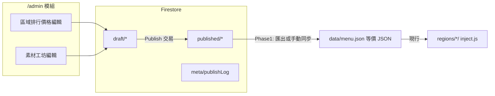

# TEATOP TOP10 · 客戶自助後台 MVP（Phase 1 後端基礎）

工程向簡述：在 **不改** 七區 `regions/<id>/` 殼層 HTML、**不改** `js/script.js` 時間軸的前提下，用 Firebase（Auth / Firestore / Storage）承載草稿與發佈；公開播放器在 Phase 1 仍讀 GitHub Pages 上的 `data/menu.json`（v1.0 視覺不變）。Phase 2 才把素材工坊（葉／圖示）接到播放器。

參考原型（本 repo，本機 localStorage 草稿）：`region-rank-price.html`、`drink-asset-review.html`。  
正式環境：https://ultronservice.github.io/teatop-menu-top10/

---

## Phase 1 vs Phase 2

| 範圍 | Phase 1（本 PR 基礎） | Phase 2 |
|------|----------------------|---------|
| 登入與 `/admin` 路由骨架 | 規格 + 環境變數；可選 `admin/` stub | 完整 zh-TW UI 模組 |
| 區域排行／大杯價 | Firestore 草稿／發佈 → **可匯出／同步** 與 `menu.json` 同 schema | 與 CI 或 Hosting 自動發佈 `data/menu.json` |
| 飲料素材對照 | Firestore + Storage；seed `data/client-asset-workshop-v1.json` | `inject.js` 讀已發佈素材覆寫葉／圖示 |
| 區域播放器 | 仍 `fetch(data/menu.json)`（見 `js/inject.js`） | 可改為讀已發佈 URL，殼層與 `script.js` 仍不動 |

---

## 認證（Auth）

- **方式**：Firebase Authentication（建議 Email/Password 或 Google；僅後台帳號，無公開註冊）。
- **授權**：Firestore Security Rules 以 `request.auth != null` + **自訂 claim `admin: true`**（或 `roles` map）限制寫入 `draft/*`；`published/*` 僅 Cloud Function／Admin SDK 可寫。
- **前端**：`/admin` 登入後持有 ID token；所有寫入帶 Auth；讀取草稿需登入，讀取已發佈選單可匿名（供未來 CDN／播放器）。

`.env.example` 列出 Web client 設定項；**不得**將真實 key 提交 repo。

---

## 草稿 vs 發佈



- **草稿（draft）**：營運可反覆儲存；不影響線上播放器。
- **發佈（publish）**：原子寫入 `published/*`，更新 `meta/lastPublishedAt`、`meta/menuVersion`（遞增整數，對應 `menu.json` 的 `version` 欄位語意）。
- **預覽**：`/admin` 以「合併 draft 或 published + 本機 preview 參數」開啟既有 `regions/<id>/`（query 或 session）；**不**在 Phase 1 改 `inject.js` 預設行為。
- **還原**：對照 repo 內 `data/menu.json` 作為 baseline（同 `region-rank-price.html` 的「還原預設」概念）。

---

## 資料模型（Firestore）

建議單租戶路徑：`brands/{brandId}/...`（`brandId` 預設 `teatop`，與 `TEATOP_TENANT_ID` 對齊）。

### 已發佈選單（播放器契約）

**文件**：`brands/{brandId}/published/menu`  
**內容**：與 `data/menu.json` **相同 JSON 形狀**（見 `data/menu.schema.json`）。

```json
{
  "version": 1,
  "regions": ["central", "central-smart", "mrt-tamsui", "north", "north-smart", "south", "ximen"],
  "items": [
    {
      "id": "qingcha-3q",
      "nameZh": "青茶3Q",
      "nameEn": "...",
      "image": "images/drinks/青茶3Q.png",
      "regions": {
        "ximen": { "rank": 3, "priceL": 55 }
      }
    }
  ]
}
```

**`inject.js` 消費方式（現行，Phase 1 不變）**：

1. `GET {assetRoot}data/menu.json`
2. 依 `data-region`／URL 解析 `regionId`
3. 對每個 `items[]`，取 `item.regions[regionId]` 有 `rank` 的品項，依 `rank` 排序
4. 注入：TOP1–5 圖片／中英文名；TOP1–10 名次、中英文名、`priceL`（缺則顯示 `—`）

發佈管線必須保證：**發佈結果**通過 `menu.schema.json` 驗證後，才可匯出為 `menu.json` 或供 Phase 2 的 fetch URL 使用。

### 草稿選單

**文件**：`brands/{brandId}/draft/menu`  
- 結構同 `published/menu`，或僅存 **覆寫格**（與 `region-rank-price.html` localStorage key 對齊）：

| 概念 | 原型 key | 建議 Firestore 欄位 |
|------|-----------|---------------------|
| 品項 × 區域 | `{itemId}\|{regionId}` | `draft/menu/overrides.{itemId}.{regionId}` 或 map 子文件 |

覆寫值：`{ "rank": number \| null, "priceL": number \| null }`（`rank: null`＝該區不進 TOP10）。

**合併規則（發佈前）**：`published/menu`（或 repo baseline）+ `draft/overrides` → 完整 `items[].regions` → 驗證 → 寫入 `published/menu`。

### 客戶品項目錄（唯讀參考）

**文件**：`brands/{brandId}/config/drinkCatalog`  
- 內容對齊 `data/client-drink-catalog.json`（`version`, `items[{ nameZh, nameEn }]`），供後台表格列與 `menu` 的 `id` 對照（`region-rank-price` 以 `nameZh` 找 `menuItem.id`）。

### 素材工坊（Phase 1 seed，Phase 2 進播放器）

**正式 seed（repo）**：`data/client-asset-workshop-v1.json`

```json
{
  "version": 1,
  "iconToggles": {},
  "leafPicks": {},
  "exportedAt": "2026-09-23T13:46:38.504Z"
}
```

**Firestore 對應**：

| 環境 | 路徑 |
|------|------|
| 草稿 | `brands/{brandId}/draft/assetWorkshop` |
| 已發佈 | `brands/{brandId}/published/assetWorkshop` |

**`iconToggles`**（對齊 `drink-asset-review.html`）：  
- Key：`{nameZh}|{columnId}`（`columnId` 來自 `ximen-name-badge-assets.json` 的欄位定義）  
- Value：`boolean`（圖示是否顯示）

**`leafPicks`**：  
- Key：`{nameZh}|{slot}`，`slot` ∈ `leftLeaf` | `rightLeaf`  
- Value：葉 catalog `id`（見 `ximen-animation-assets.json` → `leafCatalog[]`）或 `"none"`

**靜態參考（不進 Firestore，或只 cache）**：

- `data/ximen-animation-assets.json` — ranks 1–5 殼層杯／葉 URL、`leafCatalog`
- `data/ximen-name-badge-assets.json` — 圖示欄與預設指派

Phase 2：`inject.js` 或薄層 adapter 在載入 `menu` 後套用 `published/assetWorkshop`（本 Phase **不實作**）。

### 發佈紀錄

**文件**：`brands/{brandId}/meta/publishLog`（或子集合 `publishEvents`）  
- 欄位：`at`（timestamp）、`by`（uid）、`menuVersion`、`assetWorkshopVersion`、`note`

---

## Storage

| 用途 | 路徑建議 | 備註 |
|------|-----------|------|
| 飲料產品圖 | `brands/{brandId}/drinks/{itemId}.png` | `menu.items[].image` 發佈時寫 **HTTPS URL** 或 Hosting 相對路徑 `images/drinks/...` |
| 自訂葉／圖示上傳（未來） | `brands/{brandId}/assets/leaves/`、`.../icons/` | Phase 1 可先只用 catalog URL；上傳需 Auth + Rules |
| 匯出 bundle（選用） | `brands/{brandId}/exports/menu-{version}.json` | 供下載或 GitHub Action 同步 `data/menu.json` |

**Rules 原則**：公開讀取僅 `published/` 對應的公開物件；`draft/` 與未發佈上傳僅 admin 可寫可讀。

---

## `/admin` 模組對照

| 路由（規劃） | 對應原型 | Firestore 主要讀寫 | 發佈產物 |
|--------------|----------|-------------------|----------|
| `/admin/login` | — | Auth | — |
| `/admin/region-rank-price` | `region-rank-price.html` | `draft/menu`（overrides 或全量） | `published/menu` → `menu.json` 形狀 |
| `/admin/drink-asset-review` | `drink-asset-review.html` | `draft/assetWorkshop` | `published/assetWorkshop` → `client-asset-workshop-v1.json` 形狀 |
| `/admin/preview/:regionId` | 開啟 `regions/{regionId}/` | 讀 draft 或 published（preview 模式） | — |

共用能力：儲存草稿、發佈、顯示最後發佈時間、權限不足時阻擋寫入。

---

## 區域播放器（僅讀已發佈）

- **Phase 1**：七區頁面結構與 `js/script.js` 不變；資料仍來自 **`data/menu.json`**（與已發佈文件內容一致即可）。
- **契約**：播放器 **只應** 依賴 `menu.json` schema + 既有 DOM class（`.Ltea01`…、`.R01price`…）；不依賴 Firestore SDK。
- **Phase 2 選項**：`inject.js` 改 fetch 目標為 `published/menu` 的 HTTPS JSON（或 Hosting rewrite），fallback 至 `data/menu.json`；素材工坊另檔載入。

---

## 實作順序建議（Phase 1 之後）

1. Firebase 專案 + Rules（draft 寫入、published 僅 server publish）。
2. 將 repo `data/menu.json`、`client-drink-catalog.json` 匯入 `published/*` 作初始線上狀態。
3. `/admin/region-rank-price`：草稿 CRUD + publish → 驗證 schema → 更新 `published/menu`（並可選匯出 PR 更新 `data/menu.json`）。
4. `/admin/drink-asset-review`：以 `client-asset-workshop-v1.json` 為空狀態 seed 同步至 Firestore。
5. Phase 2：`inject.js` 擴充讀取 `published/assetWorkshop`（不動動畫時間軸）。

---

## 相關 repo 檔案

| 檔案 | 角色 |
|------|------|
| `data/menu.json` / `data/menu.schema.json` | 播放器與發佈的 canonical schema |
| `data/client-drink-catalog.json` | 後台 20 品列 |
| `data/client-asset-workshop-v1.json` | 素材工坊正式起點（空 toggles／picks） |
| `js/inject.js` | 資料注入（Phase 1 不改） |
| `.env.example` | Firebase Web client 占位 |
